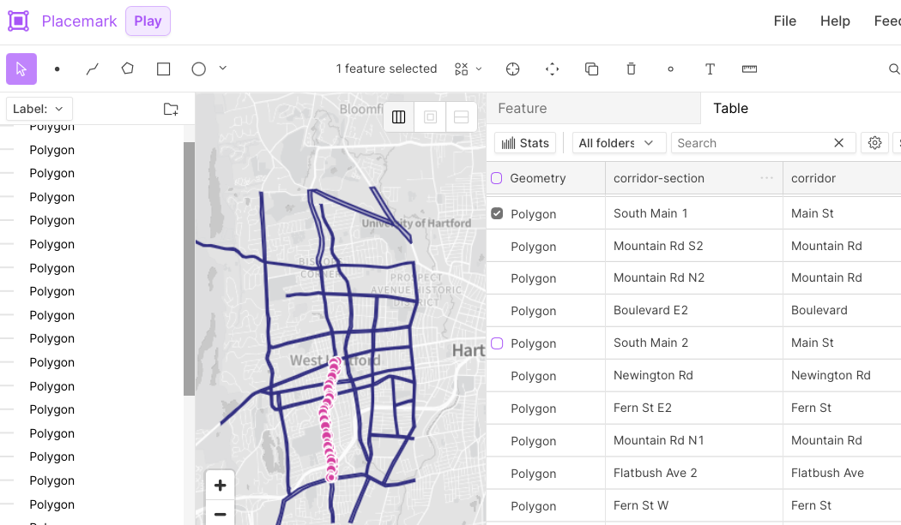
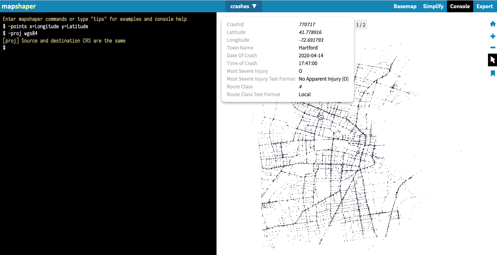

# wh-crash-analysis
West Hartford CT 2018-22 crash analysis by <https://BikeWestHartford.org> last updated 2023 06 29

See 17 April 2023 WH Crash Analysis <https://bikewesthartford.org/crash-analysis-2023/>, including two-page PDF and Google Sheet with data tables <https://docs.google.com/spreadsheets/d/1yHVNrofSd3VYd-qGA5LcLhwwhTOYQc8SRUN9hVC44xw/edit#gid=854889833>, both downloaded into this repository with related files

See 29 June 2023 New Britain Ave Google Sheet with data tables <https://docs.google.com/spreadsheets/d/1K0evno0HxcpEBUtUqjWsAeaoDfW3HbNsd9l462_SanM/edit?usp=sharing> and downloaded into this repository with related files

## Sources and Methods
This crash analysis began with a visual review of West Hartford Crash heat map <https://bikewesthartford.github.io/wh-crashes> to identify "hot spots" of frequent crash locations. We desired to more precisely identify streets with frequent crashes, but the tabular data from police reports in the [CT Crash Data Repository](https://www.ctcrash.uconn.edu) do not uniformly name Roadways. (For example, police may list several different names or route numbers for New Britain Avenue.) Also, a police report for a crash in a parking lot may list the nearest street address (1417 New Britain Ave), although the incident happened a large distance from the roadway.

As a result, this crash analysis blends two methods: spatial and tabular. For crashes on local roadways, the police report in the CT Crash Data Repo includes latitude-longitude coordinates, which we plot on a map to determine whether it spatially falls into a defined "corridor". Corridors are polygons we have drawn that follow the contours of a road, with a buffer to capture those alongside the centerline, regardless of name changes (such as when Park Road becomes Sedgwick Road, we name it all the Park-Sedgwick corridor). For crashes on the I-84 limited-access interstate highway (and its entrance or exit ramps), the police report seems to reliably label these as Roadway type = 1, so we can separate those out into a different spreadsheet, which avoids confusing the local road spatial analysis (especially where the interstate crosses over or under local corridors).

Note that our local corridor spatial analysis simplifies crashes at intersections (e.g. Main St and Park Rd) by arbitrarily assigning them to only one corridor (either Main St OR Park Rd), regardless of the original direction of the motor vehicle(s).

The steps below for drawing, cleaning, spatially joining, and analyzing crash data use manual methods with easy-to-learn free or open-source tools in your browser, as described in <https://HandsOnDataViz.org> open-access book. Our work is produced by non-specialist citizens, and we make all of our data and methods public in order to be transparent. Professionals may conduct a more sophisticated analysis with different results using more complex or proprietary GIS tools. We welcome specialists doing more sophisticated crash analyses to achieve our common goal of Vision Zero and elimination of fatal and serious crash injuries.

### Draw Corridors (polygons)
- Draw polygons to represent major local corridors (excluding Interstate I-84) using <https://Placemark.io> free tool
  - One option is to import key street centerlines from a public source, then use Placemark right-click > Operations > buffer tool to draw uniform radius around each one, converting into polygons. But this does not address changing widths of roads (such as New Britain Ave).
  - Instead, the option used here was to digitally hand-draw each corridor.
- Inside Placemark in Features or Table, create two properties for each polygon:
  - corridor = simplified uniform name for pivot tables after join steps below
  - corridor-section = detailed name to identify roadway and section on map (such as North Main St 2, the second polygon segment of this street)
- Export polygons in GeoJSON format and name file: `wh-corridors.geojson`

### Download and Clean Crash Data (points)
- Login to CT Crash Data Repository <https://www.ctcrash.uconn.edu> and run query where years = 2015-present and Town = West Hartford. Note that crash reports are typically delayed 1-6 months. Download CSV table 0 (crash events, not individual people involved) and rename to `YYYY-MM-DD-wh-crashes-export-from-ct-repository.csv` and move first row to Notes tab.
- Keep one copy of CSV in repo and also upload to Google Sheets for subsequent steps <https://docs.google.com/spreadsheets/d/1yHVNrofSd3VYd-qGA5LcLhwwhTOYQc8SRUN9hVC44xw/edit#gid=854889833>
- In CSV, filter to only crashes during five-year study period (2018-2022). Note that even months later, some fatal crash reports from Dec 2022 have not yet been uploaded to CT Crash Data Repo, so note those in the report.
- Remove unnecessary columns but keep these:
  - CrashID, Latitude, Longitude, Date of Crash, Crash Severity (w text), Most Severe Injury (w text), Route Class (w text), Roadway Name (but not uniformly reliable)
- In CSV, create two more subset tabs:
  - 2018-22-Interstate: where Route Class = Interstate (I-84 highway or entrance & exit ramps), as reported by police. Remove from spatial analysis because crashes on limited-access highway must be separate from local roads crossing above or below I-84.
  - 2018-22-not-i84: where Route Class does NOT equal Interstate. This is the focus of our spatial analysis, and we cannot rely on police reports of route names because these are not uniform. Export only this CSV and rename to `crashes.csv` for simplicity in next steps

### Join Polygons to Points in Mapshaper
- Upload `crashes.csv` (crash points) to <https://mapshaper.org> tool
- In Mapshaper, Click to open Console to convert CSV to points on map with command:
  - `-points x=Longitude y=Latitude` (carefully check column headers to confirm names)
- In Console in Mapshaper, confirm map projection (orientation of spatial data) with this command:
  - `-proj wgs84`
- In Mapshaper, click arrow to Inspect Features, and properties of each point should appear

- Upload `wh-corridors.geojson` to Mapshaper
- In Mapshaper Console, confirm map projection with this command:
  - `-proj wgs84`
- In Mapshaper, select 'crashes' to make it the active layer
- In Mapshaper Console, join polygons to specific crash points with command:
  - `-join wh-corridors fields='corridor,corridor-section'` which translates as: Join the polygon outlines of each corridor to crash points located inside it, and copy the fields named 'corridor' and 'corridor-section' to each crash point
  - Note that only crash points located inside polygons will receive new data
- In Mapshaper, inspect features of points to see new 'corridor' and 'corridor-section' columns when present. This "joined" data allows us to do better pivot tables with more uniform corridor names in next steps.
- In Mapshaper, rename 'crashes' file to 'crashes-joined' and export in CSV format

### Pivot table and calculations
- Upload 'crashes-joined.csv' to existing Google Sheets <https://docs.google.com/spreadsheets/d/1yHVNrofSd3VYd-qGA5LcLhwwhTOYQc8SRUN9hVC44xw/edit#gid=854889833>
- Create pivot table of 'count' of 'corridor' by Most Severe Injury (where K=killed and A=serious). Sort to identify corridors with most crashes, by type, and calculate percent of total in each column.
- see final table in Google Sheets and PDF in repo

### New Britain Avenue corridor 1-mile sections
- Given the high number of crashes with any injuries on the New Britain Avenue corridor, using methods above we divided this 3-mile corridor into three 1-mile sections (west, middle, east) to identify broad patterns.
- See `wh-corridors-newbritain3.geojson` for polygon boundaries
  - West mile (Farmington border to Wolcott Park)
  - Middle mile (Wolcott Park to Quaker Lane)
  - East mile (Quaker Lane to Hartford border)
- Joined with point data to create: `crashes-noti84-newbritain3-2018-22.csv`
- Created pivot table in Google Sheets <https://docs.google.com/spreadsheets/d/1K0evno0HxcpEBUtUqjWsAeaoDfW3HbNsd9l462_SanM/edit?usp=sharing>
- Downloaded Excel backup: `2023-06-29-wh-newbritain3-crash-tables.xlsx`

| West Hartford crashes reported on New Britain Avenue corridor, 2018 thru 2022 |  |  |  |  |
|---|---|---|---|---|
| 1-mile sections of New Britain Ave corridor | All Crashes | Pct Total | with Any Injuries | Pct Total |
| West mile (Farmington border to Wolcott Park) | 275 | 29% | 76 | 24% |
| Middle mile (Wolcott Park to Quaker Lane) | 308 | 32% | 115 | 36% |
| East mile (Quaker Lane to Hartford border) | 368 | 39% | 128 | 40% |
| Total | 951 | 100% | 319 | 100% |

Notes: Based on police reports to CT Crash Data Repository as of 12 April 2023. See BWH WH Crash Analysis.
We refer to the continuous roadway as "New Britain Avenue corridor" but the official name varies.
