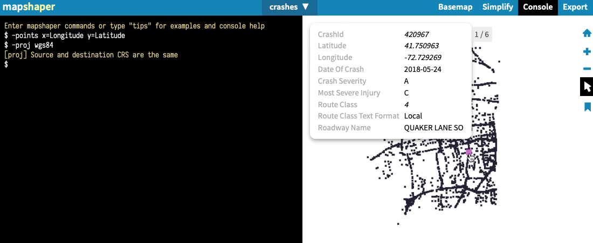
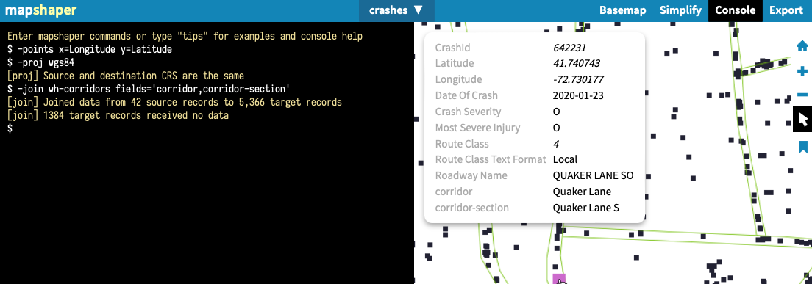

# wh-crash-analysis
Preliminary analysis of WH crashes

## Sources and Methods
- Start with visual review of West Hartford Crash Map <https://bikewesthartford.github.io/wh-crashes> to identify hot spots of frequent crash locations. Use method below to spatially identify polygons (corridors) of frequent crash locations with more precision, since police reports do not name roadways uniformly.
- Steps below for drawing, cleaning, and spatially joining crash data use manual methods with easy-to-learn free or open-source tools in your browser, as described in <https://HandsOnDataViz.org> open-access book. The same type of analysis can be conducted with more complex or proprietary GIS tools.

### Draw Polygons (Corridors)
- Draw polygons to represent major corridors using <https://Placemark.io> free tool
  - One option is to import key street centerlines from a public source, then use Placemark right-click > Operations > buffer tool to draw uniform radius around each one, converting into polygons. But this does not address changing widths of roads.
  - The option used here is to hand-draw each corridor.
- Inside Placemark in Features or Table, create two properties for each polygon:
  - corridor-part = detailed name to identify roadway and section on map (such as North Main St 2, the second polygon segment of this street)
  - corridor = simplified name for pivot tables after join steps below
  - Inside the tool, create a property called 'corridor' or 'intersection' and name each polygon (Main St, etc.)
- Download polygons in GeoJSON format and name file: `wh-polygons.geojson`

### Download and Clean Crash Data
- Login to CT Crash Data Repository <https://www.ctcrash.uconn.edu> and run query where years = 2015-present and Town = West Hartford. Note that crash reports are typically delayed 1-6 months. Download CSV table 0 (crash events, not individual people involved) and rename to `wh-crashes-export-YYYY-MM-DD` and move first row to notes tab.
- In CSV, keep all crashes in first tab, then create 2nd tab to show only crashes during study period (2018-2022). Note that even months later, some fatal crash reports from Dec 2022 have not yet been uploaded to CT Crash Data Repo. Remove unnecessary columns but keep these:
  - CrashID, Latitude, Longitude, Date of Crash, Crash Severity (w text), Most Severe Injury (w text), Route Class (w text), Roadway Name (but not uniformly reliable)
- In CSV, create 3rd and 4th tabs with these subsets:
  - 3rd tab = 2018-22-Interstate: where Route Class = Interstate (I-84 highway or entrance & exit ramps), as reported by police. Remove from spatial analysis because crashes on elevated limited-access highway must be distinct from local roads underneath.
  - 4th tab = 2018-22-NotInterstate: where Route Class does NOT equal Interstate. This is the focus of our spatial analysis, and we cannot rely on police reports of route names because these are not uniform.
  - Export all spreadsheet tabs in Excel format to repo and rename `wh-crashes-tabs-2023-04-22.xls`
  - export 4th tab (2018-22-NotInterstate) and rename to `crashes.csv` for simplicity in next steps

### Upload and Join Polygons to Points in Mapshaper
- Upload `crashes.csv` (crash points) to <https://mapshaper.org> tool
- In Mapshaper, Click to open Console to convert CSV to points on map with command:
  - `-points x=Longitude y=Latitude`   (carefully check column headers to confirm names)
- In Console in Mapshaper, confirm map projection (orientation of spatial data) with this command:
  - `-proj wgs84`
- In Mapshaper, click arrow to Inspect Features, and properties of each point should appear

- Upload `polygons.geojson` to Mapshaper
- In Mapshaper Console, confirm map projection with this command:
  - `-proj wgs84`
- In Mapshaper, select 'crashes' to make it the active layer
- In Mapshaper Console, join polygons to specific crash points with command:
  - `-join wh-polygons fields='corridor,corridor-part'` which translates as Join the polygon outlines of each corridor to crash points located inside it, and copy the fields named 'corridor' and 'corridor-part' to each crash point
  - Note that only crash points located inside polygons will receive new data
- In Mapshaper, inspect features of points to see new 'corridor' and 'corridor-part' columns when present. This "joined" data allows us to do better pivot tables with more uniform corridor names in next steps.
- In Mapshaper, rename 'crashes' file to 'crashes-joined' and export in CSV format

### Product 1: Pivot table
- Open 'crashes-joined.csv' spreadsheet
- Create pivot table of 'corridor' by count to identify uniformly-named roadways with the most crashes, or percent of total crashes.

### Product 2 to come
 Display results of pivot table in a Datawrapper choropleth map, with custom basemap of wh-polygons.geojson
